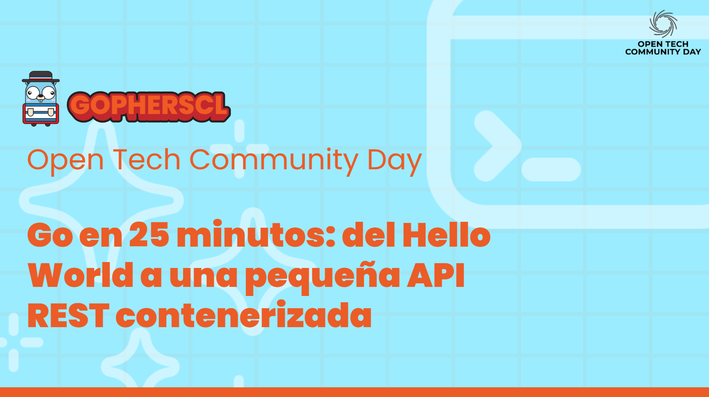

# Go en 25 minutos: del Hello World a una pequeña API REST contenerizada
Repositorio de la charla [Go en 25 minutos: del Hello World a una pequeña API REST contenerizada](https://docs.google.com/presentation/d/1S6OwyBLYl50mKCHwA31Fy9kBrTwjUe9us3fIp9Zvsig/edit?usp=sharing) realizada en la Open Tech Communit Day el 4 de Octubre del 2025 en la Universidad de los Andes.

## Estructura
El repositorio está dividido en varias carpetas, de menor a mayor complejidad

- 01 - Hello World
- 02 - Variables y tipos de datos
- 03 - Funciones y control de estructuras
- 04 - Arrays, Slices y Maps
- 05 - Structs
- 06 - API Rest Contenerizada

## Herramientas necesarias
- Go
- Un editor de código
- Ganas de aprender

## Temas a abordar
- Introduccion de Gophers CL
- Fundamentos de Go
- 6 Ejemplos prácticos con Go

## Temas que no abordaremos
- Punteros
- Goroutines
- Generics